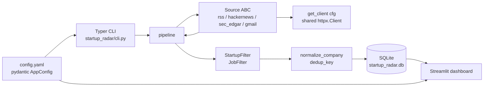

# Architecture

Startup Radar is a ~5 kLOC single-user Python tool. It pulls funding signals from a handful of free public sources, stores them in a single SQLite file, and serves a Streamlit dashboard on top.

## Package layout



## Data flow

The flow is one-directional and synchronous. Every run:

1. `load_config()` validates `config.yaml` against `AppConfig`.
2. The pipeline iterates `SOURCES` registry; each source's `fetch(cfg, storage=None)` is wrapped in `try/except/finally` + `storage.record_run(...)`.
3. Filters drop candidates that don't match the user's criteria, dedup on normalized company name, and insert into SQLite.
4. The Streamlit dashboard reads from the same DB.

Async and background workers were considered and rejected — see [Critique Appendix](CRITIQUE_APPENDIX.md) §12.

## Storage

- Single SQLite file (default `startup_radar.db`), WAL-enabled, one `sqlite3.Connection` per process, writes wrapped in `with self._conn:`.
- Schema migrations are homegrown — drop `NNNN_<slug>.sql` into `startup_radar/storage/migrations/`, the `apply_pending()` migrator walks them using `PRAGMA user_version`. No alembic; see [Critique Appendix](CRITIQUE_APPENDIX.md) §4.
- `Storage` is a Protocol in `storage/base.py`; the default implementation is `SqliteStorage`. The factory `load_storage(cfg)` is the only sanctioned entry point.

## HTTP surface

All outbound HTTP goes through `startup_radar.http.get_client(cfg)` — a process-cached `httpx.Client` with `timeout=cfg.network.timeout_seconds` and a `startup-radar/<version>` `User-Agent` (Phase 13). `requests` is no longer a direct dep.

## Retries and failure counters

Source network calls go through `startup_radar.sources._retry.retry(fn, on=(...), context={...})` — three attempts, `(1, 2, 4)` second backoff, no `tenacity`/`backoff` dep. Each pipeline run records a row in the `runs` table; `startup-radar status` reads `storage.last_run` + `storage.failure_streak` to render a per-source health block, and `startup-radar doctor` emits a `⚠ source.<key>.streak` warning after 3 consecutive failures. See the [observability rule](https://github.com/xavierahojjx-afk/startup-radar-template/blob/main/.claude/rules/observability.md).

## Logging

Structlog with a stdlib bridge, configured exactly once per process — at the CLI `@app.callback` and inside the dashboard shell. `CI=1` or `STARTUP_RADAR_LOG_JSON=1` flips the renderer to JSON; locally it's a pretty `ConsoleRenderer`. Library code never calls `print()` (sanctioned only in `cli.py`, `research/deepdive.py`, and `tests/`).

## Out-of-scope by design

The following were explicitly considered and dropped (see [Critique Appendix](CRITIQUE_APPENDIX.md)):

- **Postgres** — single-file SQLite is the contract.
- **alembic** — homegrown migrator is 35 LOC and owns its constraints.
- **Async pipeline** — source fetches are I/O-bound but sequential is fine for single-user cadence.
- **Dashboard auth** — this is a local tool.
- **Sentry** — structlog + `runs` + `doctor` cover it.
